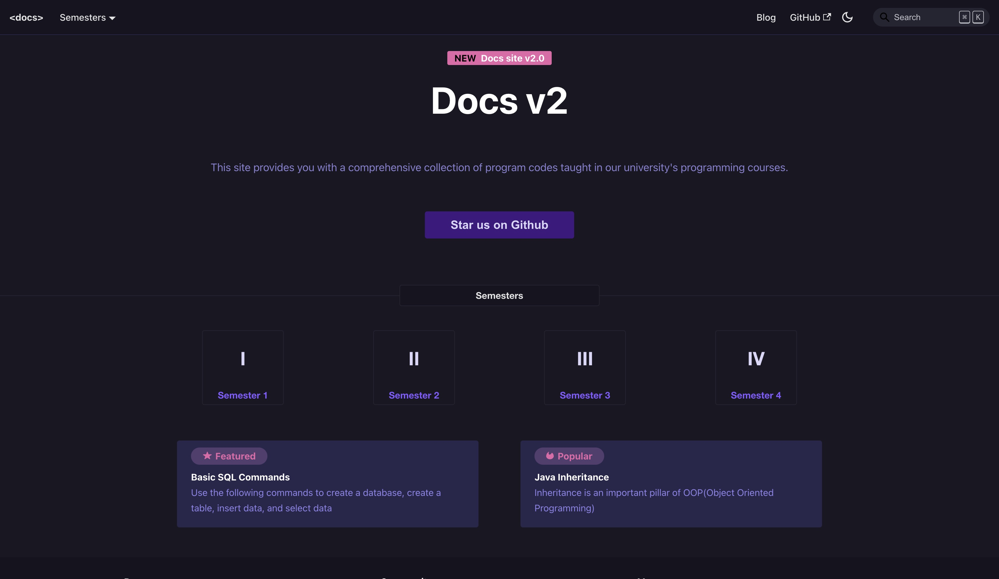
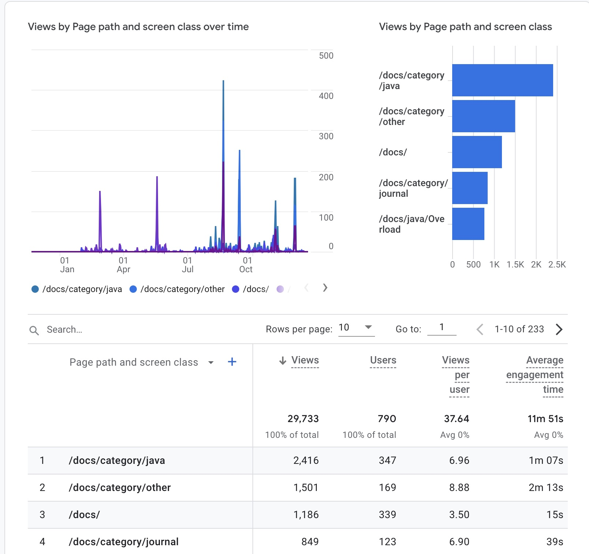

Today, I am excited to announce **Docs 2.0 🥳**

Docs 2.0 is a complete rewrite of the Old Docs site and has added a lot of new features and improvements.

### New Features

- **Built-in Search**: Docs 2.0 features a lightning-fast search powered by [**easyops-local-search**](https://github.com/easyops-cn/docusaurus-search-local). Access it using command + k.
- **Dark Mode**: Easily toggle the site's dark mode by clicking the moon icon in the top right corner.
- **Semester Dropdown**: Navigate between semesters effortlessly with the new dropdown menu.
- **Popular and Featured**: The homepage now includes sections showcasing popular and featured pages for quick access.

## Blogs

A blog section has been added to the site that will be used to post updates about the site and other announcements. It will also serve as a channel for posting articles related to programming and technology that were previously posted on the [**Medium**](https://medium.com/@tejasbhovad).

## Open Source

Docs 2.0 is completely open source and is available on [**GitHub**](https://github.com/TejasBhovad/docs). Feel free to contribute to the site by opening a pull request.

## 2023 - Year in Review

Almost 800 users have visited the site since its launch in Jan 2023 and it amounted to almost 30k views.
