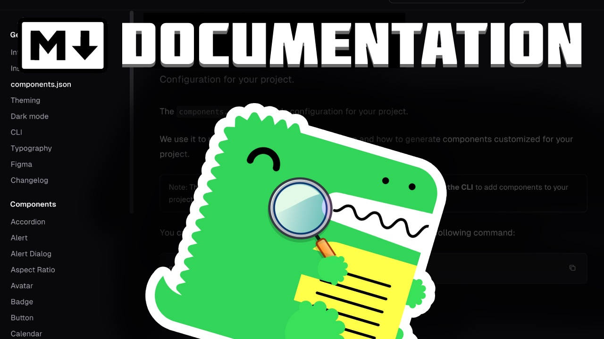
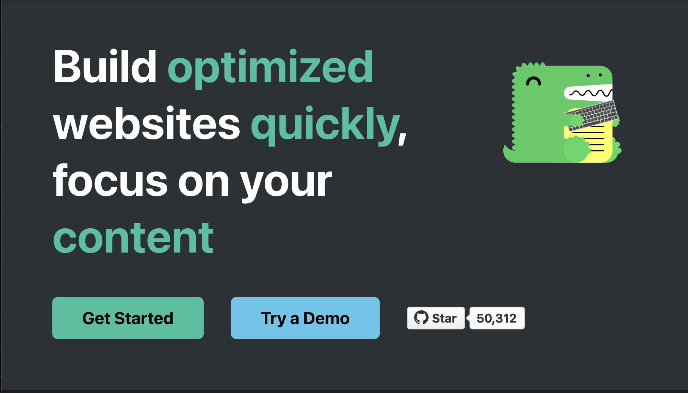
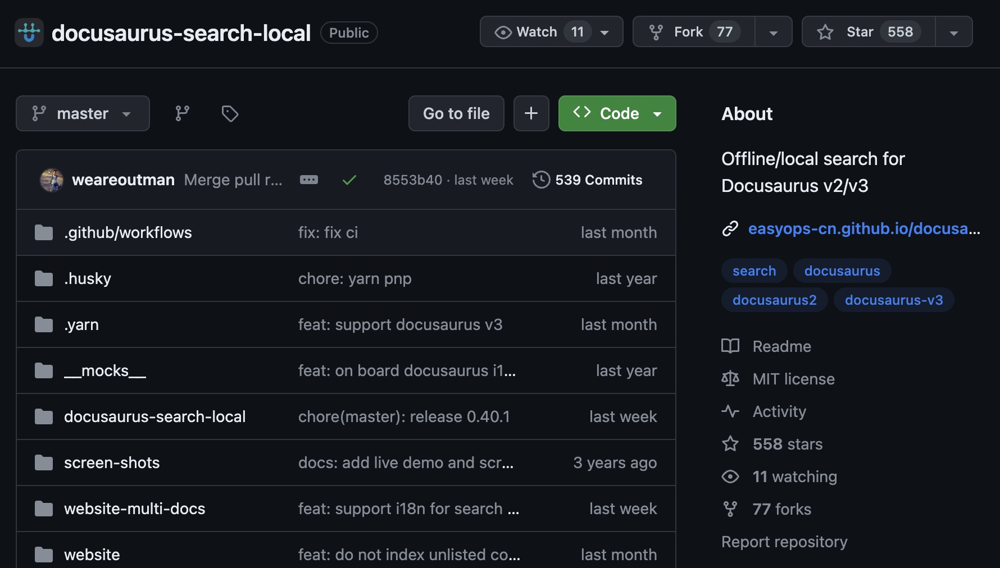

Docusaurous is an easy to use documentation tool bey Meta. In this article we will look into how to build a basic Docusaurous site and add Search bar to it.

If you prefer a video tutorial, I have a 3 minute video on the same

<iframe
  width="560"
  height="315"
  src="https://www.youtube.com/embed/fIJxcaqeUBE?si=R5y9xwdtubzuITAy"
  title="YouTube video player"
  frameborder="0"
  allow="accelerometer; autoplay; clipboard-write; encrypted-media; gyroscope; picture-in-picture; web-share"
  allowfullscreen
></iframe>

## Step 1: Basic Docs Setup

Head to https://docusaurus.io/docs#fast-track
Copy the installation command from the above page.



Open VS Code, and open the terminal, paste the copied command and let the site build

If the installation doesn't proceed and is stuck, press `ctr+c` to terminate current session and run `npm i` to install the node modules

run `npm run start` to start development server, a window will automatically appear in your default web browser

## Step 2: Setting up Local Search

Now, Docusaurous doesn't have a built in search bar, it does officially have partnership with Algolia search, but it requires a particular checklist to be satisfied. We will be using an open source alternative: https://github.com/easyops-cn/docusaurus-search-local

Head to https://github.com/easyops-cn/docusaurus-search-local?tab=readme-ov-file#installation and copy installation code, and paste it in the terminal

Now in the usage section https://github.com/easyops-cn/docusaurus-search-local?tab=readme-ov-file#usage, copy the following code

```js
  plugins: [
      require.resolve("@easyops-cn/docusaurus-search-local"),
      ({
        hashed: true,
      }),
    ],
```

And paste it into the config section in `docusaurus.config.js` file
Restart the dev server and search bar should appear in the top right

The Search will not work in development server, to test it, you need to build the site.

Build the site

```
npm run build
```

Serve the site

```
npm run serve
```

> Thanks for reading.
