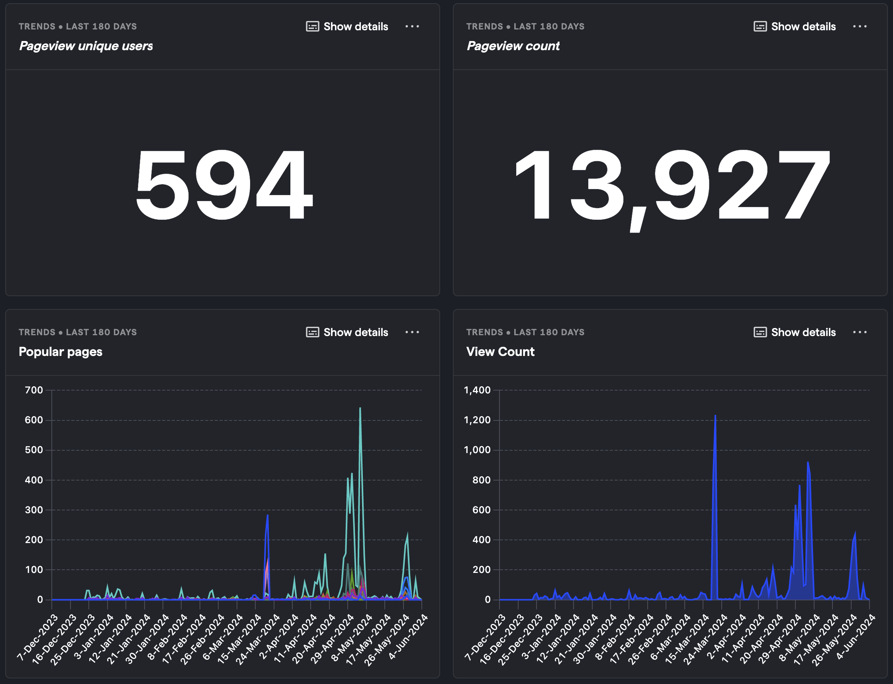
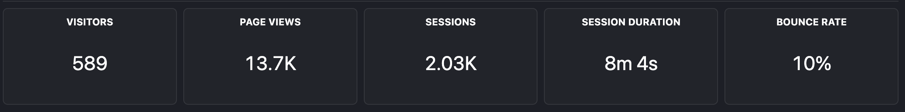
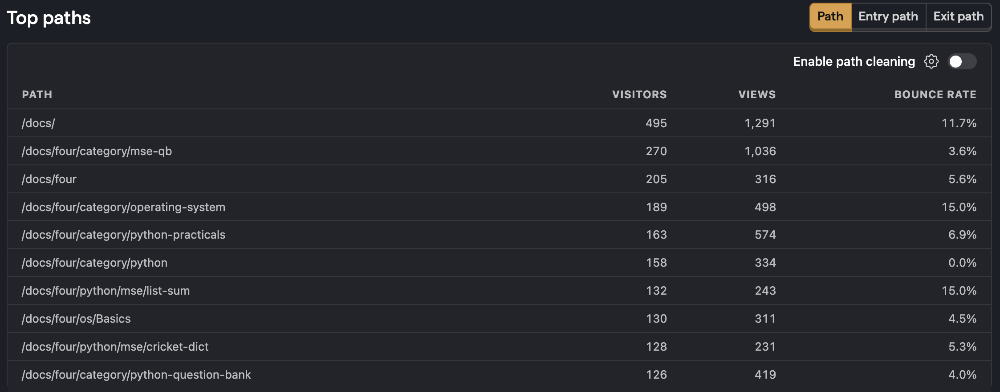

## ⏮️ Semester in Review

Its been a great semester and I hope everyone found this site helpful.

## 📂 Open Source

The project will continue to be Open Source, welcoming contributions from individuals. You can submit a PR with new sections for review. To facilitate contributions, I will establish clear contributing guidelines, enabling even first-time OS contributors to enhance the project.

## V3 features

Exciting features are in the pipeline for v3, and I am committed to delivering them promptly.

### 📚 Notes Repository

I am also developing a portal for easy access to all college-related academic documents, including notes and answer keys for various upcoming topics.

The repository for notes site is on https://github.com/TejasBhovad/notes

## 🚀 Future plans and Roadmap

To find the roadmap of this project refer [https://codes.super.site/](https://codes.super.site/)

We are also working on a way to take you feedback/bug reports easily so stay tuned.
